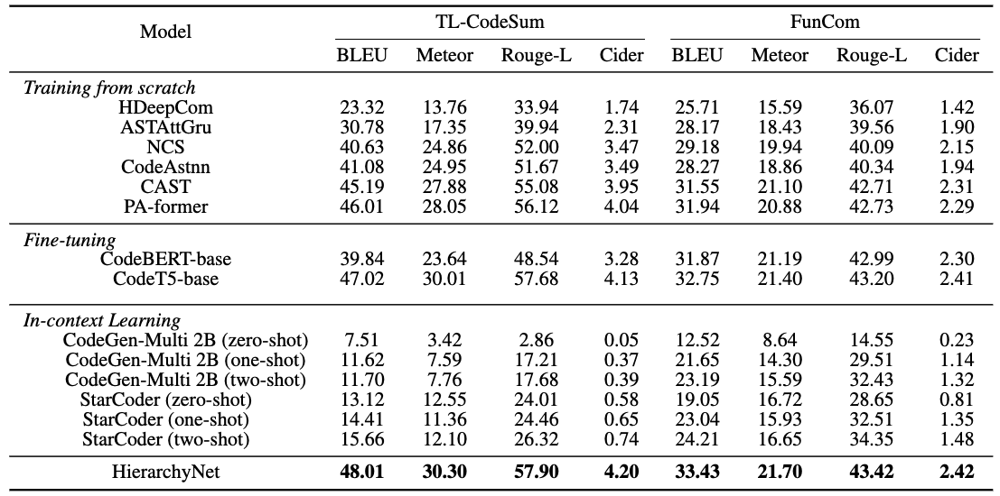
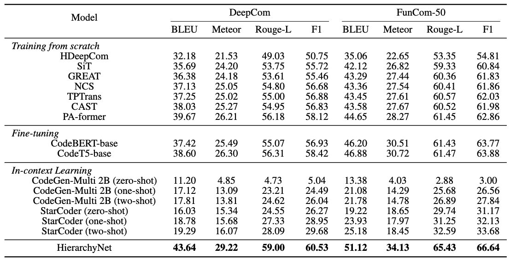

## [EACL 2024] HierarchyNet: Learning to Summarize Source Code with Heterogeneous Representations

***

Existing code summarization approaches primarily leverage Abstract Syntax Trees (ASTs) and sequential information from source code to generate code summaries while often overlooking the critical consideration of the interplay of dependencies among code elements and code hierarchy. However, effective summarization necessitates a holistic analysis of code snippets from three distinct aspects: lexical, syntactic, and semantic information. In this paper, we propose a novel code summarization approach utilizing Heterogeneous Code Representations (HCRs) and our specially designed HierarchyNet. HCRs adeptly capture essential code features at lexical, syntactic, and semantic levels within a hierarchical structure. Our HierarchyNet processes each layer of the HCR separately, employing a Heterogeneous Graph Transformer, a Tree-based CNN, and a Transformer Encoder. In addition, our approach demonstrates superior performance compared to fine-tuned pre-trained models, including CodeT5, and CodeBERT, as well as large language models that employ zero/few-shot settings, such as StarCoder and CodeGen. 
  

#### Environment

***

All source code are written in Python. Besides Pytorch, we also use many other libraries such as DGL, scikit-learn, pandas, jsonlines.

#### Run
***

1. Datasets
All the datasets used in the paper are publicly accessible.

3. Data preprocessing: 
Folder [*preprocessing*](https://github.com/FSoft-AI4Code/HierarchyNet/tree/master/preprocessing) is used to prepare data in the proper format before training. Go to this folder for more information.

4. Modify the configuration file in the folder c2nl/configs such that all the paths are valid

5. Train model

```

cd c2nl

bash main/train.sh

```
#### Experimental Results
***
1. Baselines
Examined baselines are grouped into three categories:

-   Training from scratch: PA-former, CAST, NCS
    
-   Fine-tuning pretrained models: CodeT5, CodeBERT
    
-   In-context learning: StarCoder and CodeGen-Multi 2B
2. Results


Results indicate that HierarchyNet surpasses the others with large margins on all the datasets. Our evaluations demonstrate that HierarchyNet, which utilizes a hierarchical-based architecture and dependencies information, significantly improves performance in code summarization tasks.
